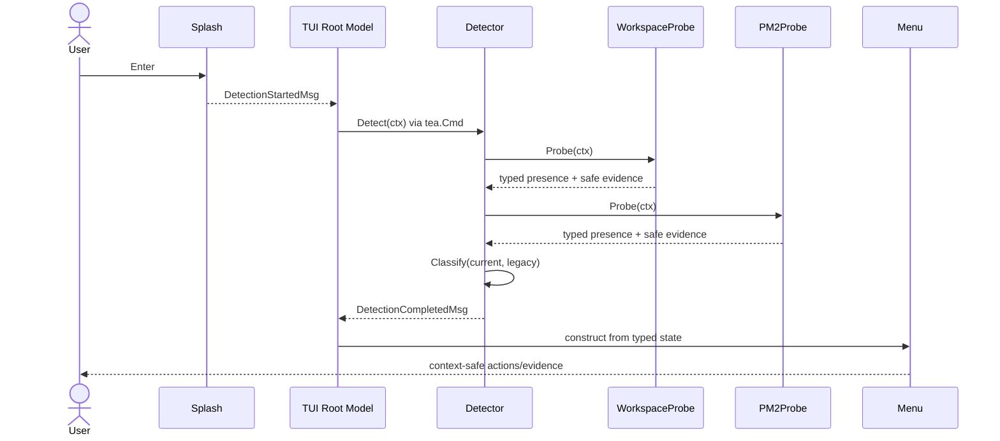
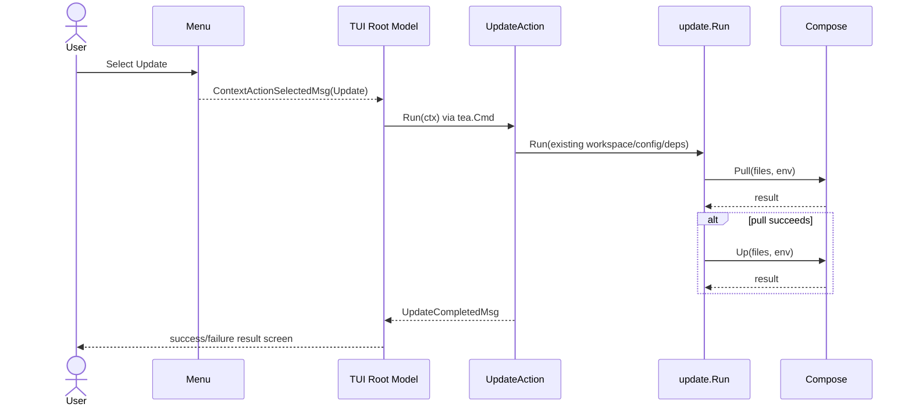
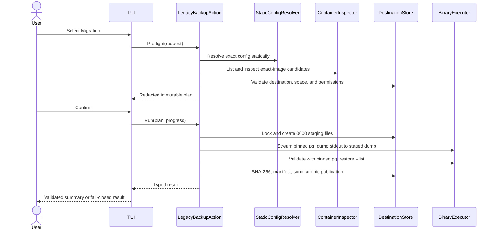

# Contextual installation menu design

## Decision summary

Insert a read-only installation detector between the splash and the existing install preflight. Put detection and classification in a new `internal/installation` package, keep platform and filesystem effects behind narrow interfaces, and let the root Bubbletea model translate detector results into contextual menu states. `Install` re-enters the existing `PreflightStartedMsg` path; `Update` calls a thin injected adapter over `update.Run`; `Uninstall` remains blocked. `Migration` may execute only Step 1: a confirmation-driven, validated PostgreSQL 11 backup behind an injected `LegacyBackupAction`. Every later migration step remains blocked.

The safety invariant is: **only complete, positive evidence enables an operation; missing, partial, conflicting, unsupported, or failed evidence never becomes permission for a destructive action.**

## Architecture

```text
cmd/installer
  ├─ constructs installation.Detector
  │    ├─ WorkspaceProbe (portable, filesystem-only)
  │    └─ LegacyFallbackProbe
  │         ├─ KnownLegacyDirectoryProbe (exact policy-owned path)
  │         └─ PM2Probe (optional Linux amd64/arm64 fallback)
  ├─ constructs UpdateAction adapter over update.Run
  └─ injects both into tui.Dependencies

internal/tui
  Splash → Detecting → ContextMenu
                         ├─ Install → existing Preflight → existing install flow
                         ├─ Update → Updating → ActionResult
                             ├─ Uninstall → BlockedOperation
                             └─ Migration → BackupPreflight → Confirm → BackupRunning
                                                            ├─ ValidatedBackup → MigrationBlocked
                                                            └─ Cancel/Failure → BackupResult

internal/installation
  Probe reports → pure Classify(...) → Detection{State, Evidence}
```

Dependency direction remains inward: `tui` consumes small interfaces and installation value types; `installation` may consume the existing `platform.CommandRunner` contract but does not import `tui`, `update`, or command wiring.

## Installation domain

### Public types

Create `internal/installation/detection.go`:

```go
type State uint8
const (
    StateNotInstalled State = iota
    StateCurrent
    StateLegacyPM2
    StateConflict
    StateUnknown
)

type EvidenceKind uint8
const (
    EvidenceWorkspaceComplete EvidenceKind = iota
    EvidenceWorkspaceAbsent
    EvidenceWorkspacePartial
    EvidenceWorkspaceInvalid
    EvidenceWorkspaceUnreadable
    EvidencePM2AliceProcess
    EvidencePM2Absent
    EvidencePM2Unavailable
    EvidencePM2Unsupported
    EvidencePM2Ambiguous
    EvidencePM2Failed
)

type Evidence struct {
    Kind   EvidenceKind
    Source string // stable category: "workspace" or "pm2"
    Detail string // sanitized, user-safe explanation; never env/process contents
    Path   string // optional cleaned path known not to contain secret data
}

type Detection struct {
    State    State
    Evidence []Evidence
}

type Detector interface {
    Detect(context.Context) Detection
}
```

`Detect` returns a value rather than `(Detection, error)` so callers cannot accidentally map an error to “not installed.” Probe failures are represented as typed evidence and classified conservatively. Evidence ordering is deterministic: workspace evidence first, PM2 evidence second, each internally sorted by stable kind/path.

### Probe result contract

Keep probe mechanics separate from final state:

```go
type Presence uint8
const (
    PresenceAbsent Presence = iota
    PresencePresent
    PresenceUncertain
    PresenceUnsupported
)

type ProbeResult struct {
    Presence Presence
    Evidence []Evidence
}

type Probe interface {
    Probe(context.Context) ProbeResult
}
```

`CompositeDetector` owns `Current Probe` and `Legacy Probe`, executes them sequentially for deterministic tests and low complexity, then calls pure `Classify(current, legacy)`.

### Classification matrix

| Current probe | Legacy probe | Final state | Rationale |
| --- | --- | --- | --- |
| absent | absent | not installed | both applicable probes confidently found nothing |
| absent | unsupported | not installed | unsupported legacy probing is explicit and not positive evidence; the portable workspace source is clean |
| present | absent/unsupported | current | complete workspace artifact contract wins without inferring PM2 |
| absent | present | legacy PM2 | Alice-specific PM2 evidence exists |
| present | present | conflict | no operation is safe automatically |
| uncertain | any | unknown | partial/invalid current artifacts must block install |
| any except uncertain | uncertain | unknown | PM2 output/error prevents reliable classification |

`unsupported` is not an error and cannot produce legacy presence. If product policy later requires unsupported platforms to block fresh install, that is a classifier-policy change; this slice follows the proposal’s explicit “unsupported/no-probe” behavior while exposing the evidence in the menu.

## Workspace probe

Create `internal/installation/workspace_probe.go`. `WorkspaceProbe{WorkspaceDir string, FS FileSystem}` validates the same required regular-file set as `workspace.ResolveArtifacts`: `.env` and `docker-compose.yml`. The optional GPU overlay does not affect installation presence.

Use a minimal filesystem seam:

```go
type FileSystem interface { Stat(string) (fs.FileInfo, error) }
```

Production uses `osFS`; tests use `t.TempDir()` with real files wherever possible. Classification rules:

- both required paths are regular files: present;
- both are missing: absent;
- exactly one is missing: uncertain/partial;
- directory, symlink-to-non-regular target, device, or other wrong type: uncertain/invalid;
- permission or other `Stat` failure: uncertain/unreadable.

To prevent the artifact contract drifting, extract a small exported `workspace.RequiredArtifactPaths(workspaceDir)` helper and have both `ResolveArtifacts` and `WorkspaceProbe` use it. `ResolveArtifacts` remains unchanged behaviorally. Paths shown as evidence are cleaned and limited to these known artifact paths; file contents are never read or displayed.

## Confirmed legacy directory and PM2 fallback

`KnownLegacyDirectoryProbe` checks only `/opt/backend_alice_guardian/node` on Linux amd64/arm64. A directory is positive Alice-specific legacy evidence and short-circuits PM2. Missing is absence and permits PM2 fallback; a regular file, permission denial, or other stat error is uncertainty and does not permit PM2 to override the safety result. Unsupported platforms do not stat the Unix path. The path is a production constant rather than user input, preventing broad parent, prefix, or arbitrary-path matching.

`LegacyFallbackProbe` composes this exact directory check with the existing PM2 probe. PM2 remains useful when the directory is absent, but sudo or user-level PM2 access is not required when the confirmed directory exists.

Create `internal/installation/pm2_probe.go` with:

```go
type CommandRunner interface {
    Run(context.Context, string, ...string) (stdout, stderr []byte, err error)
}

type LegacyPolicy struct {
    ProcessNames    []string
    ScriptBasenames []string
    DeploymentRoots []string
    EcosystemFiles  []string
}

type Platform struct { GOOS, GOARCH string }
```

Production can reuse `platform.OSCommandRunner`; inject `runtime.GOOS/runtime.GOARCH` as values at composition time. On Linux amd64/arm64, invoke exactly `pm2 jlist` with a bounded context timeout. Parse stdout with `encoding/json` into a private minimal schema containing only `name`, `pm_exec_path`, and `pm2_env.{cwd,pm_exec_path}`. Do not retain or expose environment maps.

A PM2 record is Alice-specific only when it satisfies a configured narrow identifier plus corroborating path evidence:

1. exact configured process name **and** an executable/cwd beneath a cleaned configured deployment root; or
2. exact configured script basename **and** cwd beneath a configured deployment root; or
3. exact configured ecosystem filename located beneath a configured deployment root.

All comparisons are exact after `filepath.Clean`; path containment uses `filepath.Rel`, rejecting `..`, absolute escapes, and equality where a file is expected. Empty default policy matches nothing. Any Alice-like name without corroborating path evidence is ambiguous, not present. Unrelated PM2 records are absent.

PM2 result semantics:

| Condition | Probe result |
| --- | --- |
| unsupported OS/arch | unsupported + `EvidencePM2Unsupported`; command not invoked |
| executable not found | absent + `EvidencePM2Unavailable` |
| valid empty/unrelated list | absent |
| one or more confidently matched records | present |
| weak Alice-like evidence | uncertain/ambiguous |
| timeout, permission denial, non-zero exit | uncertain/failed |
| malformed or structurally unusable JSON | uncertain/failed |

The command error seam should distinguish executable absence with `errors.Is(err, exec.ErrNotFound)` (or an injected sentinel in tests). Stderr is never copied into evidence because it can contain paths or operational data; evidence uses fixed remediation text.

## Bubbletea state machine

### New states and messages

Add to `internal/tui/model.go`:

- `StateDetecting`
- `StateContextMenu`
- `StateUpdating`
- `StateBlockedOperation`
- `StateActionResult`

Messages:

```go
type DetectionStartedMsg struct{}
type DetectionCompletedMsg struct{ Detection installation.Detection }
type ContextActionSelectedMsg struct{ Action ContextAction }
type UpdateCompletedMsg struct{ Err error }
type BlockedOperationDismissedMsg struct{}
```

`SplashModel.Update(Enter)` emits `DetectionStartedMsg`, replacing its current direct preflight message. The root handles it by entering `StateDetecting` and returning an injected detector command. The command is the only detection trigger, making cancellation before Enter side-effect-free and direct `Update` tests deterministic.

### Context menu policy

`NewContextMenuModel(theme, detection)` derives immutable actions from state:

| State | Menu content |
| --- | --- |
| not installed | Install |
| current | Update, Uninstall |
| legacy PM2 | Migration |
| conflict | no action; evidence summary and exit guidance |
| unknown | no action; evidence summary and remediation guidance |

Uninstall remains a blocked informational destination. Migration is available only for a confidently detected `legacy-pm2` installation and only when an injected `LegacyBackupAction` is available. Selecting Migration enters the Step 1 backup flow described below; it does not authorize restore, application shutdown, schema mutation, container lifecycle operations, volume changes, or deletion. Escape returns safely before confirmation; cancellation during execution propagates through the operation context and cleans partial artifacts. Conflict/unknown screens allow only quit. Evidence rendering maps typed kinds to fixed safe labels and known paths; it never formats arbitrary PM2 JSON, config contents, environment values, or stderr.

### Existing-flow reuse

- **Install:** selection emits the existing `PreflightStartedMsg`; all subsequent preflight/bootstrap/workspace/install transitions remain untouched.
- **Update:** inject `UpdateAction` into `tui.Dependencies`:

  ```go
  type UpdateAction interface { Run(context.Context) error }
  ```

  The production adapter captures `update.Config{WorkspaceDir}` and existing compose/GPU dependencies, invokes `update.Run`, and discards textual progress for the first slice. The TUI enters `StateUpdating`, runs once as a `tea.Cmd`, then shows success/failure in `StateActionResult`. This preserves `update.Run`’s artifact resolution and pull-then-up contract rather than duplicating it.
- **Uninstall:** no execution interface is added.
- **Migration:** inject only `LegacyBackupAction`; successful backup transitions to a blocked next-step screen. No generic migration executor exists, so a non-nil backup dependency cannot authorize later behavior.

Window-size messages continue to be handled globally. New views obey the existing 80×24 guard.

## Command wiring

In `cmd/installer/main.go`, extend only `newDependencies` for interactive dependencies:

1. Enable the confirmed `/opt/backend_alice_guardian/node` directory through `KnownLegacyDirectoryProbe`; keep PM2 `LegacyPolicy` identifiers empty until separately confirmed.
2. Build `WorkspaceProbe` from `f.WorkspaceDir` (therefore honoring `--workspace-dir`).
3. Build `PM2Probe` with `platform.OSCommandRunner`, runtime platform values, and timeout.
4. Inject `CompositeDetector` and an update adapter into `tui.Dependencies`.

Do not move detection before CLI routing. Explicit `update`, `restart`, `--dry-run`, and `--unattended` branches continue to return before `tea.NewProgram`; they neither probe PM2 nor enter the menu. Existing explicit update remains the operational fallback.

## Data flow





## Conflict and error semantics

- Probe errors are evidence, not logs-as-state and not absence.
- Workspace uncertainty always yields `StateUnknown`, even if PM2 is confidently present, because a partial current deployment may coexist with legacy resources.
- Confident current plus confident legacy yields `StateConflict` even if either deployment is stopped.
- PM2 absence due specifically to missing executable is safe absence; permission, timeout, malformed JSON, and non-zero exit are uncertainty.
- Empty legacy policy plus a valid PM2 list cannot identify Alice and returns absence unless records look Alice-like only through an exact configured hint; broad substring matching is forbidden.
- No detector or blocked-screen path writes files, invokes compose, stops processes, or deletes resources.

## Strict-TDD seams and test plan

Implementation must proceed test-first. Prefer direct `Model.Update` tests over full terminal tests.

| Boundary | Test style | Required scenarios |
| --- | --- | --- |
| `Classify` | table-driven pure unit tests | all matrix rows, conflict precedence, uncertainty precedence, unsupported behavior |
| workspace probe | `t.TempDir()` table tests | complete, empty, partial, unreadable where portable, directory/wrong type, workspace override |
| PM2 parser/matcher | table-driven fixture tests | empty, unrelated, each supported exact match, weak/ambiguous, path traversal/prefix collision, malformed JSON, no secret retention |
| PM2 command probe | fake runner | exact `pm2 jlist`, not found, non-zero, timeout, permission error, unsupported command-not-called |
| contextual menu | direct `Update` tests | action derivation, cursor/selection, Escape/quit, blocked choices emit no command |
| root state machine | direct `Update` tests | splash→detecting→menu; Install→existing preflight; Update once→result; conflict/unknown no actions |
| update adapter | fake compose runner | existing pull→up order, pull failure blocks up, workspace passed through |
| wiring/routes | command tests | explicit update/restart/dry-run/unattended unchanged; detector used only by interactive model |
| rendering | deterministic golden tests | menu for each state, blocked screen, small-terminal behavior; update through repository `-update` path only |

Use an injected fake detector returning a fixed `Detection`; never inspect a developer home directory. External PM2 integration tests, if added, must honor `testing.Short()` and must not become required for unit confidence.

## File change plan

| File/area | Change |
| --- | --- |
| `internal/installation/detection.go` | state, evidence, probe results, pure classifier, composite detector |
| `internal/installation/workspace_probe.go` | portable artifact probe |
| `internal/installation/pm2_probe.go` | Linux PM2 JSON probe, policy, parser/matcher |
| `internal/installation/*_test.go` | strict-TDD unit coverage |
| `internal/workspace/artifacts.go` | extract shared required-artifact paths without behavior change |
| `internal/tui/context_menu.go` | menu, detecting/blocked/result views and messages (keep simple to control scope) |
| `internal/tui/model.go`, `splash.go` | states, dependency interfaces, transitions, rendering delegation |
| `internal/tui/*_test.go`, `testdata/golden/*` | transition, no-side-effect, resize, and rendering updates |
| `cmd/installer/main.go`, `main_test.go` | detector/update adapter composition and route invariants |
| `README.md`, `RUNBOOK.md` | platform limits, evidence semantics, blocked operations |

## Cross-platform behavior

- Workspace checks use `filepath`/`os.Stat` and remain portable.
- PM2 execution is gated before command construction to Linux amd64/arm64.
- The confirmed `/opt/backend_alice_guardian/node` path is the sole hard-coded legacy directory signal; no parent, prefix, or user-controlled path is accepted.
- Permission-based tests must skip when the host (for example Windows or root) cannot reproduce denial; classifier tests still cover unreadable evidence deterministically through a fake filesystem.
- Do not add build tags unless a platform-specific implementation becomes necessary; injected platform values keep logic testable on any CI host.

## Rollout and rollback

Roll out as one behaviorally isolated interactive-flow change. Detection is read-only and creates no persistent state or migration. Document that legacy detection is Linux-only and that Uninstall/Migration are informational.

Rollback is mechanical: restore splash Enter to emit `PreflightStartedMsg`, remove detector/menu dependencies and states, and leave `internal/installation` unused or remove it. Explicit update/restart, dry-run, and unattended routes remain unchanged throughout, so rollback preserves operational access.

## Change-size forecast

A production-only implementation can likely stay near **300–380 changed lines** by using one compact `internal/installation` package and one combined contextual TUI file. A strict-TDD implementation including meaningful table tests, root transition updates, golden changes, wiring tests, and documentation is more realistically **650–900 changed lines**. Therefore the complete safe change is **not credibly under 400 changed lines**.

To protect review quality, split delivery into two reviewable slices if the 400-line budget is firm:

1. detector domain/probes/shared workspace contract with exhaustive tests;
2. TUI states, update adapter, command wiring, route tests, and docs.

The split costs an intermediate internal API review but avoids weakening safety tests merely to satisfy a line budget.

## Design acceptance checklist

- [ ] Detection cannot mutate the filesystem or invoke lifecycle commands.
- [ ] Partial or failed evidence cannot enable Install or destructive actions.
- [ ] PM2 matching requires exact configured identifiers plus path corroboration.
- [ ] Unsupported platforms never execute PM2 or infer legacy presence.
- [ ] Install reuses the current preflight transition.
- [ ] Update delegates to `update.Run` and preserves pull-before-up behavior.
- [ ] Uninstall has no execution dependency; Migration exposes only the narrow Step 1 `LegacyBackupAction`.
- [ ] A validated backup cannot trigger restore or any destructive migration behavior.
- [ ] Explicit CLI and non-interactive routes bypass contextual detection.
- [ ] Tests use injected seams, direct `Update`, and temporary workspaces.

## Migration Step 1: validated PostgreSQL 11 backup

### Scope and fail-closed invariant

This addendum supersedes the earlier blocked-Migration decision only for backup creation. The operation reads the exact legacy configuration, inspects Docker metadata, streams a database dump to a protected local artifact, validates it, and publishes a secret-free manifest. It MUST NOT start, stop, restart, restore, modify, or delete containers, applications, databases, volumes, or source files.

Only `OutcomeValidated` may produce the completed backup UI and enable a future separately specified step. All other outcomes remain terminal and fail closed.

### Package and dependency boundaries

Create `internal/migration` as the policy owner. The TUI depends only on the action and redacted result types; it never receives credentials, raw config, Docker environment maps, command stderr, or generic command execution.

```go
type LegacyBackupAction interface {
    Preflight(context.Context, BackupRequest) (BackupPlan, error)
    Run(context.Context, BackupPlan, ProgressSink) BackupResult
}

type StaticConfigResolver interface {
    Resolve(context.Context, ConfigRequest) (ResolvedConfig, error)
}

type Environment interface {
    Lookup(string) (string, bool)
}

type ContainerInspector interface {
    Candidates(context.Context, ImageIdentity) ([]ContainerSummary, error)
    Inspect(context.Context, ContainerID) (ContainerDetails, error)
}

type BinaryExecutor interface {
    Run(context.Context, ProcessSpec, io.Writer) ProcessResult
}

type DestinationStore interface {
    Prepare(context.Context, DestinationRequest) (StagedArtifact, error)
}
```

`ResolvedConfig` keeps the password in an unexported secret holder with explicit zero/release semantics where practical. It exposes only redacted fields and source categories. `BackupPlan` is immutable after confirmation and binds the selected config fingerprint, immutable container ID/image identity, destination directory identity, final names, and timeout. `Run` revalidates mutable preconditions before executing.

Additional injectable seams are `Clock`, `SpaceChecker`, `Lock`, `Hasher`, and the minimal staged-file operations needed for mode, sync, rename, directory sync, and cleanup. Production adapters may use `os`, `syscall`/`unix`, and `os/exec`; tests use `t.TempDir()`, deterministic fakes, and no real Docker or database.

Do not expand the existing `docker.DockerClient`, buffered `platform.CommandRunner`, or line-oriented `StreamingCommandRunner`. Add a migration-specific Docker CLI adapter and binary executor under `internal/migration` (with only the low-level reusable process adapter in `internal/platform` if reuse is demonstrated). This prevents migration identity policy from leaking into general Docker or TUI APIs.

### Static configuration parsing without JavaScript execution

Read only `/opt/backend_alice_guardian/node/config/config.js`, after proving it is a regular file and not a symlink. Enforce a size limit before reading. Never import, `require`, transpile, evaluate, or execute it.

Implement a closed parser for the supported CommonJS object shape. Accepted values are string/integer literals and narrowly recognized `process.env.NAME || literal` or `process.env.NAME ?? literal` expressions. Reject calls, imports, computed properties, spreads, template expressions, getters, concatenation, arbitrary member access, duplicate keys, and any syntax outside the grammar.

Resolution is explicit and deterministic:

1. Select the environment from the confirmed migration request; default only to the documented production selection. Never silently select test or merge objects.
2. For each approved field, use a referenced host environment override when present and non-empty; otherwise use the config literal fallback. Environment lookup is restricted to the exact referenced name.
3. Development may use the documented host, port, database, and user fallbacks only when development was explicitly selected.
4. Production with no port resolves to PostgreSQL default `5432`; other missing required values fail.
5. Require PostgreSQL dialect and valid typed host, port, database, username, and password. Dynamic, malformed, ambiguous, unsupported, or unresolved values stop before Docker execution.

Parser errors use fixed field/category codes and source locations without source excerpts or values. Logs, UI, plans, manifests, `%v` formatting, and test fixtures MUST NOT contain credential values. Tests use synthetic placeholders and assert that sentinel secret material is absent from errors and serialized output.

### Exact container discovery

The inspector lists all containers, including stopped ones, then filters by exact normalized image identity `bitnami/postgresql:11-debian-10`. Every candidate is inspected by immutable full container ID. Safe metadata is limited to image reference/digest, name, state, health, labels, mounts, network mode, and published ports; full environment output is neither returned nor logged.

Selection correlates image identity with config endpoint, database/user presence indicators, expected Bitnami data mounts, and exact Compose/service labels when available. Image match alone is never sufficient. Exactly one sufficiently corroborated candidate is required:

- zero candidates or insufficient corroboration: precondition failure;
- multiple plausible candidates: `OutcomeAmbiguousContainer`, with safe candidate IDs and evidence categories for operator review; never select first/newest/by-name;
- stopped candidate: block and instruct the operator to start it externally;
- unhealthy candidate with a declared healthcheck: block;
- running candidate without a healthcheck: allowed only to attempt the dump connection after all identity checks;
- daemon permission/unavailability, inspect failure, malformed output, image alias uncertainty, or endpoint conflict: unknown/precondition failure.

No code path invokes Docker start/stop/restart. The connection endpoint used inside the selected container must be proven as container-local; host-published addresses are not translated heuristically. If this endpoint cannot be derived unambiguously, fail closed.

### Cancellable PostgreSQL 11 binary streaming

Use the selected exact Bitnami PostgreSQL 11 container for both tools. Invoke argv directly, never `sh -c`:

```text
docker exec <immutable-id> pg_dump --format=custom --file=- --host=<proven-container-host> --port=<port> --username=<user> --dbname=<database>
docker exec <immutable-id> pg_restore --list <staged-dump-path-contract>
```

The concrete validation transport must be finalized without mutating the container: either stream the host staged dump to pinned `pg_restore --list` stdin when PostgreSQL 11 supports that contract, or run an explicitly version-pinned PostgreSQL 11 client container with a read-only bind mount. If neither can be proven, implementation is blocked; `docker cp` or writing the dump into the source container is forbidden.

`ProcessSpec` contains executable, argv, allowlisted environment, timeout, and redaction metadata. The password is never in argv. Create a mode-`0600` temporary pgpass file outside the published artifact set, pass only its path through `PGPASSFILE` in the child environment, do not log environment or rendered commands, and remove it immediately after process completion. If the chosen `docker exec` transport cannot make that host pgpass file available without a protected read-only mount or secure stdin contract, fail closed rather than falling back to `PGPASSWORD`, argv, shell interpolation, or interactive echo.

The executor attaches binary stdout directly to the staged dump `io.Writer`; it never buffers the dump. Stderr is bounded in memory only for internal fixed-code classification and is never returned raw. Context cancellation and timeout terminate the process tree, wait for exit, close writers, and return a typed result. Cancellation is checked before discovery, before process start, after streaming, before validation, and immediately before publication.

#### Credential transport decision — approved helper container (2026-07-11)

This decision supersedes the rejected `docker exec` and `docker cp` alternatives for Slice 4.3. The selected legacy container remains inspection-only. A separate helper uses direct argv equivalent to:

```text
docker run --rm --pull=never --name <random> --label alice-installer.migration-helper=true --label alice-installer.migration-operation=<random> --network host --mount type=bind,src=<0700-temp>/pgpass,dst=/run/alice-installer/pgpass,readonly --env PGPASSFILE=/run/alice-installer/pgpass bitnami/postgresql:11-debian-10 pg_dump --format=custom --file=- --no-password --host=<resolved-host> --port=<resolved-port> --username=<resolved-user> --dbname=<resolved-db>
```

The approved image policy is exact identity equality with `bitnami/postgresql:11-debian-10` and `--pull=never`; aliases, broad major tags, and host clients are rejected. The host creates a unique `0700` directory and a `0600` `pgpass` file, validates both with `Lstat` before mounting, and deletes the directory after use. The password exists only in that file and is cleared from the resolver holder after writing. The mount target and `PGPASSFILE` value are fixed non-secret constants.

`OSBinaryExecutor` starts direct argv in a dedicated process group, streams stdout directly to its supplied writer, bounds stderr to 4 KiB for fixed-code classification, and kills the group on cancellation or timeout. No raw stderr crosses the boundary. `--rm` is normal cleanup; random names and operation labels prevent collision, and `CleanupHelper` issues direct `docker rm --force <name>` as idempotent named reconciliation after a client regains control. Fakes capture only argv/spec metadata and scan all observable records for a synthetic secret sentinel. This is process-boundary proof only: it deliberately does not start a real Docker process in tests, orchestrate a dump, create backup artifacts, validate, or expose TUI behavior.

The rejected alternatives remain rejected: `docker exec` cannot attach a per-exec host bind mount, `docker cp` introduces unproven daemon-side copy/cleanup races, stdin is a secret-bearing unproven transport, and `PGPASSWORD`, shell interpolation, or password argv are forbidden.

#### Credential transport decision — 2026-07-11 retry (superseded)

The proposed temporary in-container `.pgpass` lifecycle was evaluated as a direct-argv candidate: create a host `0700` temporary directory and `0600` pgpass file, stream a tar archive through `docker cp - <immutable-id>:<unique-allowlisted-path>`, run direct `docker exec <immutable-id> chmod 600 <path>`, then run direct `docker exec -e PGPASSFILE=<path> <immutable-id> pg_dump ... -w` and direct `rm -f -- <path>` cleanup. The path and mode values are non-secret; the password would be only tar-stream payload.

This candidate remains **blocked**. The installed Docker CLI manual proves only that `docker cp` copies between a container and local filesystem; it does not establish stdin tar framing, destination mode semantics, daemon-side cancellation behavior, diagnostic redaction, or transactional cleanup. More importantly, a client timeout/cancellation or partial copy can leave a daemon-side write racing after the client process is killed; a subsequent direct `docker exec rm` cannot prove it reaches the daemon, wins that race, or runs when Docker is unavailable. Fakes can prove our argv, redacted metadata, streaming, bounded stderr, and cleanup *attempts*, but cannot prove those Docker daemon properties without an approved real-Docker contract. Since the requirement is deletion on every failure, timeout, cancellation, and partial-transfer path, no production transport, fake harness, or future `pg_dump` invocation may be added until that contract is independently proven. Temporary credential-file mutation is otherwise the only contemplated container mutation; no lifecycle mutation is permitted.

### Protected destination, atomic publication, and cleanup

Require an operator-selected backup directory or a documented protected default outside the legacy application tree. Resolve and validate every existing path component without following symlinks; reject unsafe ownership, non-directory components, destinations under migration source paths, and directories not writable by the invoking identity. Create a missing approved directory with `0700` only after confirmation.

Before dumping, acquire a non-blocking operation lock scoped to the installation/container and destination. Check available bytes through `SpaceChecker` against a documented conservative minimum plus reserve; treat this only as preflight because `ENOSPC` remains possible.

Create unique dump and manifest staging files in the destination with `O_CREATE|O_EXCL`, mode `0600`. Never overwrite existing final names. On error, timeout, cancellation, empty/short output, validation failure, checksum failure, sync failure, or manifest failure, close and remove every staging file, pgpass file, lock, and any published half-pair. Cleanup is idempotent and preserves pre-existing files.

Publication order is transactional at the pair level:

1. stream dump, sync, close, and validate while staged;
2. compute SHA-256 and byte size from the finalized staged bytes;
3. create, encode, sync, and close the staged manifest;
4. re-check cancellation and destination identity;
5. rename dump and manifest without replacement, then sync the directory;
6. if either rename or directory sync fails, remove files created by this operation and report incomplete.

Both final files remain `0600` and owned by the invoking user or explicitly configured service account.

### Validation and secret-free manifest

A zero `pg_dump` exit is insufficient. Run PostgreSQL 11-compatible `pg_restore --list` against the staged custom-format dump without connecting to any database. Require successful exit and a non-empty structurally valid archive listing. Do not retain or publish the listing.

The versioned manifest contains only: UTC timestamp, collision-safe source container identity, exact image reference/digest, selected config environment, redacted endpoint/database/user fields, custom dump format, byte size, SHA-256, pinned dump/restore client versions, validation status, and tool schema version. It excludes password, pgpass path/content, config path/content, environment names and maps, labels that were not explicitly allowlisted, mounts containing sensitive paths, command stderr, and process environment.

`BackupResult` outcomes are typed: `validated`, `cancelled`, `precondition-failed`, `ambiguous-container`, `config-unsupported`, `dump-failed`, `validation-failed`, and `destination-failed`. Error messages are selected from fixed safe catalogs. Only `validated` includes the final artifact paths, checksum, size, and safe manifest summary.

### TUI states and transition contract

Add `StateBackupPreflight`, `StateBackupConfirm`, `StateBackupRunning`, `StateBackupResult`, and `StateMigrationBlocked`, with typed messages for plan completion, confirmation, progress, cancellation, and result. The root model injects `LegacyBackupAction`; sub-models never construct commands or filesystem adapters.

```text
legacy-pm2 menu
  → Migration selected
  → BackupPreflight (static config + exact container + destination checks)
  → BackupConfirm (redacted summary only)
  → BackupRunning (cancellable progress categories, no raw output)
  → BackupResult
       ├─ validated → MigrationBlocked: “backup validated; later steps unavailable”
       └─ any other outcome → retry preflight or safe exit
```

Escape before confirmation returns without mutation. Confirmation is the first point at which directory/file creation may occur. During execution, Escape requests cancellation and waits for cleanup; it must not immediately quit while a child process may still run. `q`/Ctrl-C follows the same cancellation handshake. Duplicate Enter/messages cannot launch a second action. Window resizing remains global.

The confirmation and result views show only selected environment, safe endpoint identity, exact container identity, destination, image identity, checksum/size after success, and fixed status text. They never show password, config contents, environment values, argv, or raw stderr. Every non-validated outcome leaves later migration unavailable.

### Data flow



### Strict-TDD seams and required scenarios

Use table-driven tests for parser/resolver, container selection, result mapping, and publication failures. Use direct `Model.Update()` tests for TUI transitions. Filesystem tests use `t.TempDir()`; external Docker/PostgreSQL tests are opt-in and skipped under `testing.Short()`.

| Boundary | Required scenarios |
| --- | --- |
| static parser/resolver | supported production/development forms, explicit environment, override precedence, default port, malformed/dynamic syntax, duplicate/missing fields, dialect mismatch, unresolved values, no secret retention |
| container inspector/selector | exact image, digest/alias handling, zero/one/multiple candidates, insufficient corroboration, stopped, unhealthy, no healthcheck, permission/daemon/inspect failure, endpoint conflict |
| binary executor | binary streaming without whole-output buffering, exact argv, no password in argv/logs, allowlisted env, bounded stderr, cancellation/timeout process termination |
| destination store | unsafe/symlink path, permissions/ownership, insufficient space, lock contention, `0600`, exclusive create, write-full, sync/rename failures, idempotent cleanup, no overwrite |
| backup action | pinned PostgreSQL 11 tools, custom format, empty dump, dump failure, restore-list failure, cancellation at every gate, checksum/size, paired atomic publication |
| manifest | deterministic schema, secret/config/stderr exclusion, checksum correctness, atomic pair failure cleanup |
| TUI | preflight/confirm/run/result transitions, duplicate-submit prevention, cancel handshake, no pre-confirmation mutation, validated-only blocked continuation |

Fakes capture redacted process metadata separately from secret environment injection so assertions cannot accidentally print credentials. Tests must scan errors, progress events, rendered views, manifests, and captured logs for a synthetic secret sentinel.

### File change plan and review slices

| Area | Expected change |
| --- | ---: |
| `internal/migration` domain, parser, discovery, executor orchestration, storage, manifest | 500–700 lines production |
| `internal/migration/*_test.go` and fixtures | 650–900 lines |
| `internal/platform` binary process adapter and tests | 120–200 lines |
| `internal/tui` backup models, messages, transitions, views, goldens/tests | 300–450 lines |
| `cmd/installer` composition and route tests | 80–140 lines |
| docs/spec alignment | 80–140 lines |
| **Forecast total** | **1,730–2,530 changed lines** |

This is not reviewable as one sub-400-line PR. Keep each slice buildable and preserve the blocked Migration destination until the final wiring slice:

1. **Static inputs (350–500 lines):** redacted types, closed config parser/resolver, environment precedence, tests.
2. **Discovery (300–450 lines):** migration-specific Docker inspection and exact selector, tests.
3. **Execution/storage (500–750 lines):** cancellable binary executor, pgpass transport proof, protected staging, space/lock/cleanup, tests.
4. **Validation/publication (350–500 lines):** pinned restore-list validation, checksum, atomic dump/manifest pair, tests.
5. **TUI and wiring (350–500 lines):** backup states, cancellation handshake, composition, route/golden/docs tests.

Slices 1–4 expose no TUI entry point and therefore cannot execute migration behavior. Slice 5 injects only the validated backup action. Any unresolved secure pgpass or pinned-validation transport is a release blocker, not an invitation to weaken the contract.

### Rollout and rollback

Ship disabled unless the complete Step 1 action and all fail-closed tests are present. Rollout is Linux amd64/arm64 first, matching legacy detection. Existing explicit CLI routes remain unchanged. Document Docker permissions, storage requirements, cancellation semantics, and that a validated backup is not proof of restorability or authorization for later migration.

Rollback removes the injected `LegacyBackupAction` and restores Migration to the informational blocked screen. Existing backup artifacts remain operator-owned and are never deleted by rollback. No persistent migration state or source-system mutation requires reversal.

### Migration Step 1 acceptance checklist

- [ ] Config parsing cannot execute JavaScript and rejects unsupported syntax.
- [ ] Environment selection and overrides are explicit, deterministic, and secret-safe.
- [ ] Exactly one corroborated immutable container ID is required; stopped, unhealthy, multiple, and unknown cases block.
- [ ] Password is absent from argv, logs, errors, UI, manifest, and test output.
- [ ] Dump and validation use pinned PostgreSQL 11-compatible clients and custom format.
- [ ] Streaming is cancellable and bounded; partial artifacts and secret files are always cleaned.
- [ ] Destination safety, ownership, permissions, free space, lock, exclusive create, sync, and atomic pair publication are verified.
- [ ] `pg_restore --list`, non-empty archive evidence, SHA-256, and size are required before publication.
- [ ] Only `validated` reaches the blocked next-step screen; no destructive migration behavior exists.
- [ ] Estimated review slices remain independently buildable and preserve fail-closed wiring.
