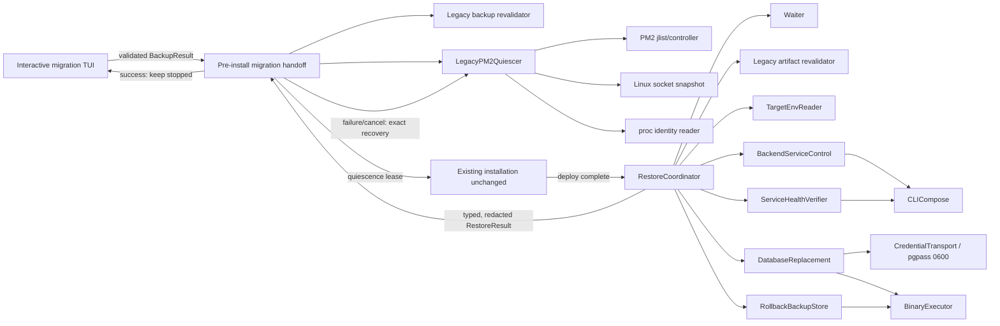
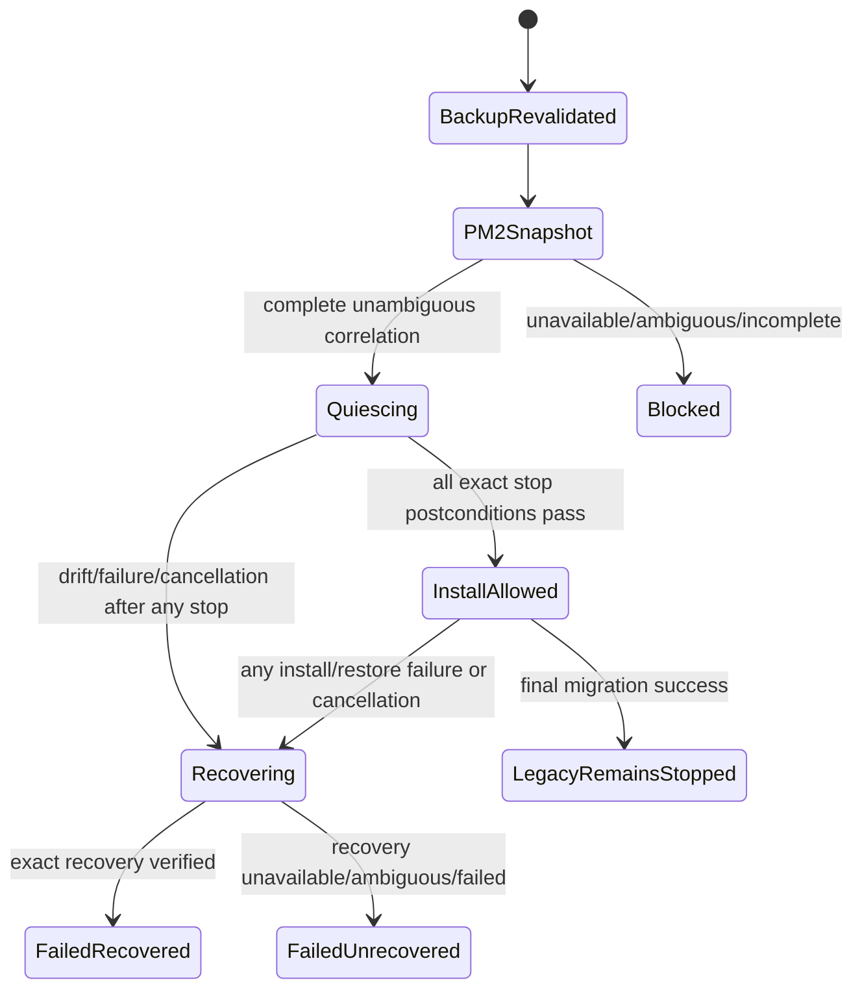
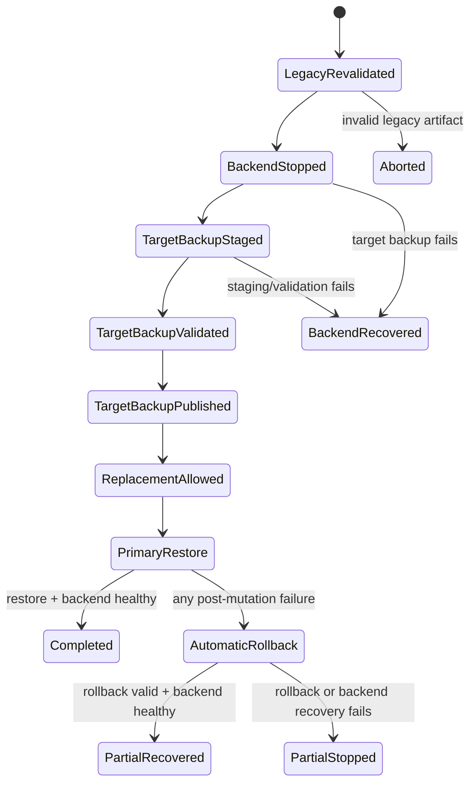
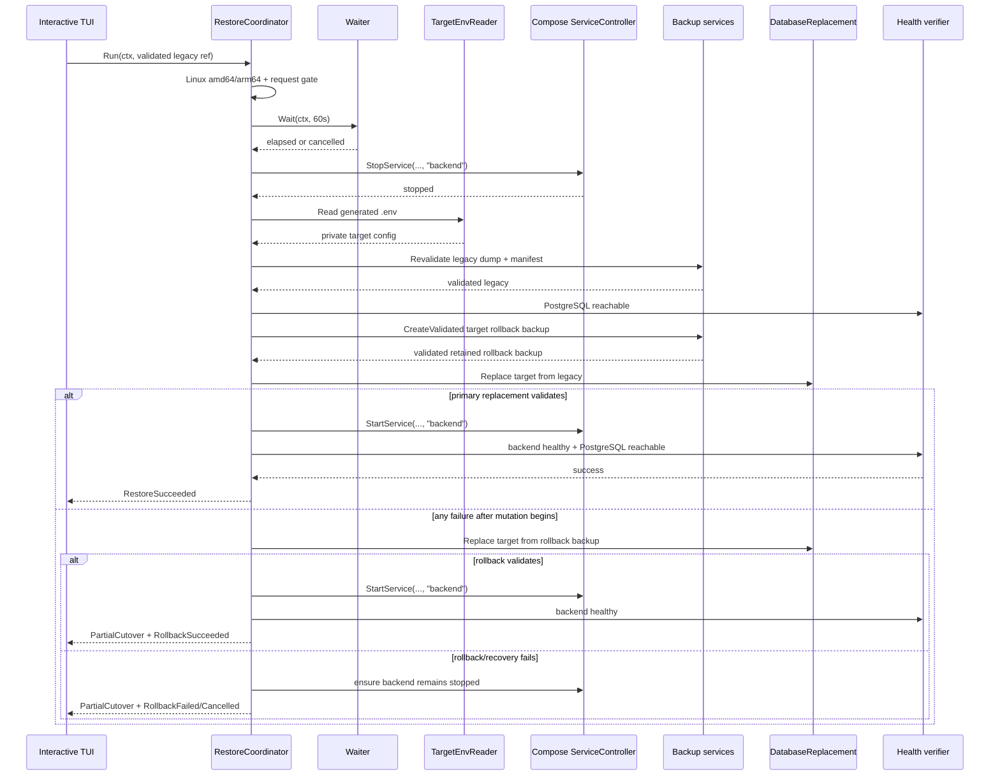

# Design: fail-closed legacy database restore with automatic rollback

## Decision summary

The interactive Linux migration path uses two separate fail-closed capabilities. A new pre-install PM2 quiescence handoff runs after the legacy backup has been revalidated and before the first installation side effect. The existing `migration.RestoreCoordinator` remains the post-deploy database cutover owner: it runs after install/deploy completes and owns the 60-second wait, backend-only service control, target credentials, second backup, database replacement, validation, rollback, and final backend health.

PM2 quiescence is deliberately not folded into observational legacy detection or database rollback. It correlates PM2 records with exact directory containment, Linux listening-socket ownership, and `/proc` process-incarnation evidence; stops only fully proven identities; and retains an exact recovery set. Every installation or restore failure and cancellation after a successful stop invokes bounded PM2 compensation. Successful migration leaves the captured legacy identities stopped.

The existing install, update, restart, dry-run, unattended/headless, Compose identities, database replacement design, and install/deploy internals remain unchanged. Only the confirmed interactive Migration handoff receives the new capability.

| Concern | Decision |
| --- | --- |
| Activation | Confirmed interactive Migration on Linux `amd64`/`arm64` only |
| Pre-install source control | Separate `LegacyPM2Quiescer`; validated backup → correlate/revalidate → selective stop → existing installation |
| PM2 identity | PM2 id/name selector is only a command address; authorization requires PMID + PID + canonical cwd/exec + required listening port + `/proc` start ticks |
| PM2 compensation | Recover only acknowledged stopped identities on every later failure/cancellation; verify recovery; never recover on migration success |
| Orchestration | Stage-aware migration handoff owns PM2 lifecycle; existing `RestoreCoordinator` continues to own database cutover |
| Waiting | Exactly one injected `Wait(ctx, 60*time.Second)` after `Compose.Up` success and before backend stop |
| Service control | Add allowlisted service-scoped `StopService` and `StartService`; only `backend` is accepted by restore wiring |
| Credentials | Parse exactly five generated `.env` keys; password remains in a private value and a mode-`0600` pgpass file |
| Backups | Revalidate legacy backup, then create/validate/atomically publish a distinct target rollback backup before mutation |
| Replacement | Maintenance connection, terminate target sessions, explicit `DROP DATABASE`, explicit `CREATE DATABASE`, direct-argv `pg_restore` |
| Validation | Bounded typed evidence: process success, target connection, non-system application table count, PostgreSQL reachability, backend health |
| Rollback | After mutation begins, automatically restore the validated target backup through the same replacement engine |
| Partial cutover | Any primary failure after mutation begins returns `PartialCutover`, even when automatic rollback succeeds; recovery status states whether service was restored |
| Delivery | Preserve the four database-migration slices; add one focused PM2 delta slice at 280–360 lines, splitting at the handoff boundary if forecast exceeds 350 |

## Scope and invariants

### Invariants

1. `backend` and `postgresql-master` remain the Compose service names; `alice_backend` and `alice_postgresql-master` remain container names.
2. Restore service control uses Compose service name `backend`, never a container name and never `Down` or broad `Restart`.
3. PostgreSQL remains running throughout cutover and rollback.
4. No target mutation occurs until both the legacy and target rollback backups are independently validated and retained.
5. No command is built through `sh -c`, `bash -c`, a shell string, or untrusted string interpolation.
6. Neither password nor pgpass content may appear in argv, errors, logs, UI messages, manifests, evidence, or Docker labels/environment metadata. `PGPASSFILE` contains only the fixed in-container path.
7. A successful database restore is not migration success. Success requires a started and healthy backend.
8. Existing non-migration paths preserve their current call order and behavior.
9. PM2 detection remains observational and unchanged; mutation uses a separate Linux-only capability.
10. A PM2 process is eligible only when one PM2 record, one `/proc` incarnation, an exact root/descendant cwd relationship, and one required listening TCP socket owner all agree.
11. PM2 commands use direct argv and one exact selector per invocation. `stop all`, `start all`, `restart all`, `resurrect`, shell execution, multi-target commands, and unproven name-only authorization are prohibited.
12. Installation cannot begin until all intended PM2 identities are proven stopped. Every subsequent failure or cancellation compensates only the acknowledged stopped set; success intentionally leaves that set stopped.

### Explicitly unchanged

- Existing environment rendering, image pull, Compose `Up`, application migrations, and seeds.
- Explicit Install, Update, Restart, uninstall, `--dry-run`, and `--unattended`/headless routing.
- Existing `ComposeRunner.Restart` and `Down` behavior for their current callers.
- Existing backup file publication rules and Compose/YAML identities.
- Existing `PM2Probe` and `LegacyPolicy` detection semantics.
- Existing database restore, target rollback, and backend recovery semantics; PM2 state is tracked separately from database `Mutated`.
- Windows behavior except that an indirect restore or quiescence invocation returns an unsupported result before side effects.

## Architecture



The pre-install handoff owns the PM2 quiescence lease across the complete existing installation and restore lifecycle. `RestoreCoordinator` does not know how to inspect or control PM2 and its database rollback remains unchanged. The handoff converts install and restore completion into one terminal migration outcome only after PM2 compensation, when required, has completed or failed with bounded evidence.

The coordinator depends on small capability interfaces rather than the full installer model. Production adapters may reuse existing `BinaryExecutor`, `CredentialTransport`, `PG11ArchiveValidator`, `DestinationStore`, and Compose argument construction, but restore gets separate request builders and typed evidence. The TUI receives narrow migration actions and cannot issue database or PM2 commands directly.

## Pre-install PM2 quiescence delta

### Placement and lifecycle ownership

The new boundary is before the current `StatePreflight` transition, because preflight/bootstrap, workspace writing, optional package setup, image pull, and Compose deployment can all produce installation side effects. The current `BackupCompletedMsg` branch is therefore split:

1. Convert the validated `BackupResult` to `BackupRef` and revalidate it through the same safe-path, regular-file, manifest, checksum, size, and archive-format gate used by restore.
2. On supported Linux, acquire and quiesce the exact legacy PM2 set.
3. Persist the returned quiescence lease only in the in-memory migration session and then enter the existing preflight/install state machine unchanged.
4. Route every later `InstallFailureMsg`, cancellation/quit path, restore failure/cancellation/partial-cutover result, panic boundary, or abandoned migration state through one bounded compensation path before rendering the terminal result.
5. On final migration success (database cutover validated, backend healthy, and existing installation verification successful), close the lease without recovery and leave the captured legacy processes stopped.

A missing quiescer, unsupported platform, failed backup revalidation, empty required legacy selection, ambiguous evidence, or incomplete stop postcondition blocks before `StatePreflight`. Ordinary Install/Update/Restart/dry-run/unattended/headless routes never construct or call this handoff.



PM2 mutation is represented by its own `PM2QuiescenceStatus`; it never sets or overloads database `Mutated`. Database automatic rollback runs first when required to protect target data, then the outer handoff attempts PM2 recovery before the terminal failure is reported. PM2 recovery is attempted even when database rollback fails, using an independent bounded recovery context.

### Capability and evidence contracts

```go
// internal/installation/pm2_quiescence.go (names may move without changing semantics)
type LegacyPM2Quiescer interface {
    Quiesce(context.Context, PM2QuiesceRequest) (PM2Quiescence, error)
    Recover(context.Context, PM2Quiescence) (PM2Recovery, error)
}

type PM2QuiesceRequest struct {
    GOOS, GOARCH string
    LegacyRequired bool // derived by trusted migration composition, never free-form UI input
}

type PM2SelectorKind uint8
const (
    PM2ByID PM2SelectorKind = iota
    PM2ByExactName
)

type PM2ProcessIdentity struct {
    PMID       int64
    Name       string
    Selector   PM2SelectorKind
    PID        int
    CWD        string
    ExecPath   string
    Port       uint16
    StartTicks uint64
}

type PM2StoppedEvidence struct {
    PMID       int64
    OriginalPID int
    Port        uint16
    StartTicks  uint64
    StopVerified bool
}

type PM2Quiescence struct {
    OperationID string
    Processes   []PM2ProcessIdentity // defensive copy, deterministic PMID order
    Evidence    []PM2StoppedEvidence // only acknowledged stopped identities
}

type PM2Recovery struct {
    Attempted, Recovered int
    Verified             bool
    Code                 string
}

type MigrationHandoffStage uint8 // platform, backup-revalidation, snapshot, stop, stop-verification, install, restore, recovery
type MigrationHandoffResult struct {
    Stage       MigrationHandoffStage
    PM2Mutated  bool
    Quiescence  PM2Quiescence
    Recovery    PM2Recovery
    Restore     RestoreResult
    Code        string // allowlisted and redacted
}
```

The numeric PM2 id is the preferred command selector. An exact name selector is allowed only when the supported PM2 output cannot address the record by id and the name is non-empty, bounded, globally unique across both the acquisition and immediate pre-command snapshots, and remains bound to the same PMID/PID/cwd/exec/port/start-ticks identity. A name never authorizes mutation by itself. Duplicate/reused names or ids fail closed. Recovery uses the captured selector only after proving it still addresses the same stopped PM2 entry; it never searches for a replacement by name.

`PM2Quiescence` is immutable at package boundaries: constructors sort and copy slices, accessors return copies, and callers cannot add recovery targets. Evidence contains no jlist JSON, environment values, socket command output, `/proc` paths beyond canonical non-secret cwd/exec identity, raw stderr, or arbitrary wrapped errors.

### Acquisition and exact correlation

One bounded acquisition snapshot is assembled immediately before mutation:

1. `PM2Inventory` executes direct argv `pm2 jlist`, bounds stdout, parses only `pm_id`, `name`, runtime PID, status, `pm2_env.cwd`, and `pm_exec_path`/`pm2_env.pm_exec_path`, and rejects malformed, duplicate, contradictory, or partially populated candidate records.
2. `LinuxSocketSnapshot` executes fixed direct argv `ss -H -ltnp`, bounds output, accepts listening TCP rows only, and yields local port-to-owning-PID evidence. Missing process metadata, malformed candidate rows, duplicate ownership, multiple owners for a required port, or permission-denied ownership evidence is an error, not absence.
3. `ProcIdentityReader` resolves `/proc/<pid>/cwd` and `/proc/<pid>/exe` without following caller-controlled paths and parses field 22 (`starttime`) from bounded `/proc/<pid>/stat`. Missing records, permission errors, parse errors, or zero values fail closed for a candidate.
4. Canonical cwd must equal a configured root or be its descendant according to `filepath.Rel`; lexical prefixes such as `/opt/alice-guardian-old` do not match. Symlink-resolved `/proc` cwd is authoritative and must agree with the cleaned PM2 cwd. Exec evidence from PM2 and `/proc` must agree when both are available; contradiction fails closed.
5. The exact allowlist is `/opt/alice-guardian` listening on TCP `8080`, or `/opt/backend_alice_guardian` listening on TCP `9090` or `4550`. Directory-only, port-only, name-only, basename-only, executable-only, and PM2 environment port claims never qualify.
6. Correlation key is runtime PID plus `/proc` start ticks. PIDs and PM2 ids must be positive and unique. Each selected identity has one unambiguous PM2 record, allowed root/port pair, socket owner, and incarnation. If trusted migration context requires a legacy PM2 source, zero qualifying identities is a fail-closed pre-install result; unrelated PM2 records/listeners remain untouched.

The existing `PM2Probe` and `LegacyPolicy.matches` remain unchanged because they answer presence, not mutation authorization.

### Stop, recovery, and race control

`PM2Controller` accepts one validated `PM2CommandTarget` and constructs only separate-token process specs:

- `pm2 stop <exact-id-or-exact-name>` for one selected identity;
- `pm2 start <same-captured-id-or-exact-name>` for one acknowledged stopped identity.

Before each stop, the quiescer reacquires PM2, socket, cwd, exe, and start-ticks evidence for the complete remaining set. Any disappearance, respawn, selector reuse, cwd/exec drift, status change, port-owner change, competing owner, or incarnation change stops further mutation. Stops run in deterministic PMID order. After each successful command, a fresh PM2 and socket snapshot must prove the captured entry is stopped, its original PID no longer owns the required listener, and unrelated records were not changed. Only then is the identity appended to the recovery set. Command success without this postcondition is ambiguous; the implementation re-observes once to classify whether that exact identity stopped, but never retries the mutation command.

Before installation begins, one final complete snapshot must prove every intended identity stopped and no required process respawned. The quiescer never chases a replacement PID.

Recovery is bounded, non-retrying, and operates in reverse stop order. Before each start it proves the captured PM2 entry/selector has not been reused and still has the same immutable config identity. A stopped process naturally receives a new runtime PID/incarnation when started; recovery therefore records a new PID/start-ticks pair and verifies it belongs to the captured PM2 entry, resolves to the same canonical cwd/exec relationship, and owns the same required listening port. A reused id/name, already-owned port, unexpected owner, changed config, failed start, or unverifiable postcondition stops further recovery and returns bounded failure. It never invokes `pm2 resurrect`, broad restart/start, a shell, or an ecosystem file.

Tool contracts fail closed:

| Condition | Quiescence result |
| --- | --- |
| `pm2` missing, timed out, non-zero, or malformed | blocked before install |
| `ss` missing, timed out, lacks PID ownership, or permission denied | blocked before install |
| `/proc` cwd/exe/stat unavailable or changes | blocked, or compensate acknowledged stops |
| cancellation before any stop | cancelled; no PM2 recovery needed |
| cancellation/failure after a stop | recover exact acknowledged set under bounded independent context |
| final migration success | no PM2 start; exact legacy set remains stopped |

### Migration handoff contract

```go
// internal/migration/handoff.go
type LegacyBackupGate interface {
    Revalidate(context.Context, BackupRef) (ValidatedBackup, error)
}

type MigrationInstallAction interface {
    Run(context.Context) InstallResult
}

type PreInstallMigrationCoordinator struct {
    Legacy       LegacyBackupGate
    PM2          installation.LegacyPM2Quiescer
    RecoveryContext func() (context.Context, context.CancelFunc)
}

// Begin validates backup and quiesces PM2, returning an opaque lease.
// CompleteSuccess consumes the lease without restart.
// CompleteFailure consumes it exactly once and performs bounded recovery.
```

The concrete TUI may model `Begin` and completion as messages rather than blocking `Run`, but lease semantics are mandatory: one owner, idempotent completion, defensive-copy stopped set, and no path that silently drops a live lease. Fakes record backup revalidation, quiesce/recover calls, exact identities, order, and terminal disposition. Production composition supplies fixed Linux adapters and timeouts; UI strings receive only stable codes and counts.

## Exact contracts and injection seams

The following contracts are the implementation target. Names may move between files during implementation only if semantics and test seams remain identical.

```go
// internal/compose/runner.go
const BackendService = "backend"

type ServiceController interface {
    StopService(ctx context.Context, files []string, envFile, service string) error
    StartService(ctx context.Context, files []string, envFile, service string) error
}

// CLICompose implements both methods with direct argv:
// docker compose -f <file>... --env-file <env> stop backend
// docker compose -f <file>... --env-file <env> start backend
```

`CLICompose` validates `service == BackendService`; empty, whitespace, multiple-token, and other service values fail before command execution. These methods may also be added to `ComposeRunner` so the existing fake records them, but restore itself accepts the narrower `ServiceController`. No service method accepts variadic service names.

```go
// internal/workspace/target_env.go
type TargetDatabaseConfig struct {
    Host     string
    Port     uint16
    User     string
    Database string
    password secretValue // unexported; zeroizable; no String/GoString/Marshal methods
}

type TargetEnvReader interface {
    ReadTargetDatabase(ctx context.Context, envPath string) (TargetDatabaseConfig, error)
}
```

```go
// internal/migration/restore.go
type Waiter interface {
    Wait(ctx context.Context, duration time.Duration) error
}

type BackupRef struct {
    DumpPath, ManifestPath, SHA256 string
    Size int64
}

type BackupRevalidator interface {
    Revalidate(ctx context.Context, ref BackupRef) (ValidatedBackup, error)
}

type TargetBackupCreator interface {
    CreateValidated(ctx context.Context, cfg TargetDatabaseConfig, destination string) (ValidatedBackup, error)
}

type DatabaseReplacement interface {
    Replace(ctx context.Context, cfg TargetDatabaseConfig, source ValidatedBackup) (DatabaseEvidence, error)
}

type PostgreSQLProbe interface {
    Reachable(ctx context.Context, cfg TargetDatabaseConfig) error
}

type BackendHealthVerifier interface {
    WaitHealthy(ctx context.Context, files []string, envFile string) error
}

type RestoreRequest struct {
    GOOS, GOARCH string
    ComposeFiles []string
    EnvFile, BackupDestination string
    Legacy BackupRef
}

type LegacyRestoreAction interface {
    Run(ctx context.Context, request RestoreRequest) RestoreResult
}
```

`ValidatedBackup` is constructible only in `migration` after safe-path, regular-file, manifest, archive-format, checksum, and size checks. It distinguishes `LegacySource` from `TargetRollback`; the target backup filename includes an operation ID and cannot collide with or overwrite the legacy artifact.

```go
type RestoreStage uint8
const (
    StagePlatformGate RestoreStage = iota
    StageWait
    StageCredentials
    StageLegacyRevalidation
    StageBackendStop
    StagePostgresCheck
    StageTargetBackup
    StageTargetReplacement
    StageRestoreValidation
    StageBackendStart
    StageBackendHealth
    StageRollback
)

type RestoreOutcome uint8
const (
    RestoreSucceeded RestoreOutcome = iota
    RestoreFailedBeforeCutover
    RestoreCancelledBeforeCutover
    RestorePartialCutover
    RestoreUnsupported
)

type RollbackStatus uint8
const (
    RollbackNotRequired RollbackStatus = iota
    RollbackSucceeded
    RollbackFailed
    RollbackCancelled
)

type DatabaseEvidence struct {
    RestoreExitOK       bool
    ConnectionOK        bool
    ApplicationTables   uint64
    PostgreSQLReachable bool
}

type RestoreResult struct {
    Outcome RestoreOutcome
    FailedStage RestoreStage
    Mutated bool
    Rollback RollbackStatus
    LegacyBackup BackupEvidence
    TargetBackup BackupEvidence
    Database DatabaseEvidence
    BackendHealthy bool
    Code string // allowlisted stable diagnostic code, never raw command output
}
```

`RestoreResult` has no password, command argv, pgpass path, raw stderr, or arbitrary wrapped error. `BackupEvidence` contains only retained path, manifest path, checksum, size, and validated flag.

## Safe `.env` parsing

`workspace.TargetEnvFileReader` opens the exact `ResolvedArtifacts.EnvFile` path with `O_NOFOLLOW` where supported, then verifies it is a regular file. It parses the installer-generated format, not general dotenv syntax.

Allowlist and mapping:

| Key | Rule |
| --- | --- |
| `POSTGRES_HOST` | exactly once; `127.0.0.1` for this Linux host-network deployment |
| `POSTGRES_PORT` | exactly once; canonical decimal integer in `1..65535` |
| `POSTGRES_USER` | exactly once; non-empty valid PostgreSQL identifier |
| `POSTGRES_PASSWORD` | exactly once; non-empty; retained only in private memory |
| `POSTGRES_DATABASE` | exactly once; non-empty valid PostgreSQL identifier; must differ from maintenance DB `postgres` |

Parser rules:

- Read with a bounded size (64 KiB) and bounded line length.
- Accept blank lines and lines whose first non-space character is `#`.
- For data lines, require exactly `KEY=value`; trim ASCII space around the key only and preserve the value bytes.
- Reject `export`, quotes, escapes, substitutions, multiline values, NUL/CR, inline comments, duplicate allowlisted keys, malformed allowlisted lines, and empty required values.
- Ignore syntactically valid non-allowlisted keys without storing their values. Reject duplicate required keys even when values match.
- Return stable field-specific codes such as `target-env-duplicate-key`; never include the line or value.
- Validate identifiers with a conservative ASCII pattern such as `^[A-Za-z_][A-Za-z0-9_]{0,62}$`. This permits safe PostgreSQL identifier construction and deliberately rejects quoted/exotic identifiers.
- Release/zero the password after pgpass creation. Tests use a sentinel and assert it is absent from `%v`, `%+v`, JSON, evidence, argv, fake command records, and UI output.

## Protected credential and process boundary

Extend the existing `CredentialTransport` pattern for target credentials:

1. Create an operation-owned directory mode `0700`.
2. Create one pgpass file mode `0600`; use escaped host, port, `*` database (maintenance and target connections), user, and password.
3. Bind-mount it read-only to `/run/alice-installer/pgpass`.
4. Pass `--env PGPASSFILE=/run/alice-installer/pgpass`; this contains no secret. Do not pass `PGPASSWORD`.
5. Defer cleanup immediately after creation. Cleanup runs on success, error, timeout, panic recovery boundary, and context cancellation. Cleanup failure changes the result code but never exposes the path or secret.
6. Use random operation-scoped helper names and non-secret labels. `--pull=never` preserves the reviewed image pin.

All process construction returns `ProcessSpec{Name: "docker", Args: []string{...}}` and executes via `BinaryExecutor`; no shell participates.

### Database process construction

Use a reviewed current PostgreSQL client image constant, distinct from `PostgreSQL11Image` used to validate the legacy archive. Every helper uses `--network host`, the protected pgpass mount, `--rm`, `--pull=never`, operation labels, and a bounded timeout.

`DatabaseReplacement.Replace` performs direct-argv steps in this order:

1. **Terminate sessions** using `psql` connected to maintenance DB `postgres`, with `--no-password`, `--set=ON_ERROR_STOP=1`, and positional `-v target_db=<validated-name>`. The SQL script is a fixed implementation-owned file mounted read-only, not a dynamically assembled `-c` string. It uses `pg_terminate_backend` and `format('%I', :'target_db')`/server-side identifier quoting where needed.
2. **Drop database** using direct argv `dropdb --if-exists --force --maintenance-db=postgres --host=<host> --port=<port> --username=<user> --no-password <validated-db>`.
3. Mark `Mutated=true` immediately before executing drop; from this boundary all failures are partial cutover and invoke rollback.
4. **Create database** using direct argv `createdb --maintenance-db=postgres --host=<host> --port=<port> --username=<user> --no-password <validated-db>`.
5. **Restore** using direct argv `pg_restore --exit-on-error --no-owner --no-privileges --no-password --host=<host> --port=<port> --username=<user> --dbname=<db> <mounted-dump>`.
6. **Validate** using fixed read-only SQL mounted into the helper: establish a fresh connection, verify `current_database()` equals the validated target, and return only a numeric count of ordinary/partitioned tables from non-system schemas excluding `pg_catalog`, `information_schema`, and `pg_toast`. Require count `>= 1`.

The dump is mounted read-only at a fixed container path. Host paths occur only in Docker mount argv and are never copied into evidence. No SQL identifier is concatenated into a shell or SQL command string. If the selected client version lacks a required direct-argv feature, implementation must fail the relevant RED test and choose a fixed SQL file plus server-side quoting; it must not fall back to shell interpolation.

## Two-backup lifecycle



The target backup uses the same custom-format, checksum, protected permission, staging, validation, and atomic publication guarantees as the legacy pipeline, but has a distinct `TargetRollback` manifest role and operation ID. Publication never replaces an existing file. Staging and pgpass artifacts are operation-owned and removable; both validated published backups are never removed automatically.

Gates before `DROP DATABASE`:

- legacy dump and manifest are safe, readable, checksum/size matching, custom-format validated, and retained;
- backend stop succeeded;
- PostgreSQL is reachable;
- target backup dump and manifest are atomically published, checksum/size matching, custom-format validated, and retained;
- target identity and credentials passed validation.

## Coordinator sequence



The exact wait is the first coordinator operation after the platform/request gate: one call with `60*time.Second`. On elapsed completion, backend stop is the next side-effecting operation; credential and artifact checks follow while the backend is stopped. `RealWaiter.Wait` uses one timer and `select { case <-timer.C; case <-ctx.Done() }`, stops/drains the timer on cancellation, and does not poll. No health timeout is reused. A fake waiter records invocation count and duration. Any credential or revalidation failure after a successful stop restarts and health-checks the backend against the still-unchanged target database.

## Automatic rollback coordinator

Rollback is an explicit coordinator branch, not `defer` magic:

- It starts only when `Mutated` is true and a validated target rollback backup exists.
- It keeps/ensures `backend` stopped and first revalidates the rollback artifact.
- It calls the same `DatabaseReplacement.Replace` engine with source role `TargetRollback`, then repeats connection/table/PostgreSQL evidence.
- If rollback database validation succeeds, it starts `backend` once and requires normal backend health. The final outcome remains `RestorePartialCutover`, with `RollbackSucceeded`, because the requested legacy cutover failed after destructive mutation.
- If rollback fails or is cancelled, PostgreSQL remains running, backend remains stopped, both backups remain retained, and the result is `RestorePartialCutover` with bounded recovery code.
- Cancellation before mutation returns `RestoreCancelledBeforeCutover`; after mutation it triggers a bounded rollback context derived from a production rollback timeout rather than the already-cancelled request context. This is the one deliberate cancellation exception needed to protect data. The result records that caller cancellation initiated rollback. A second process/host shutdown cancellation may stop rollback and yields `RollbackCancelled`.
- No automatic rollback retries, merges, or unvalidated restores occur.

### Failure and partial-cutover semantics

| Boundary | Outcome | Backend | Automatic action |
| --- | --- | --- | --- |
| Platform/wait | unsupported/failed/cancelled before cutover | unchanged | none |
| Backend stop fails | failed before cutover | unknown/unchanged; no DB mutation | none |
| Credentials, legacy gate, PostgreSQL check, or target backup fails after stop but before mutation | failed before cutover | restart once and health-check against unchanged DB | preserve artifacts |
| Primary failure after drop boundary | partial cutover | stopped | restore validated target backup |
| Primary valid, backend start/health fails | partial cutover | stopped or unhealthy | restore target backup, then one start/health attempt |
| Rollback succeeds and backend healthy | partial cutover, rollback succeeded | healthy against pre-cutover target | operator told legacy cutover failed but service recovered |
| Rollback or recovery fails | partial cutover, rollback failed/cancelled | stopped | operator recovery guidance only |

These rows describe database/backend recovery. Independently, any terminal failure or cancellation after PM2 quiescence triggers exact PM2 compensation after database handling. A PM2 compensation failure does not rewrite database rollback evidence; the outer migration result carries both bounded statuses and cannot report success.

Recovery guidance is selected by stable `Code`; it names retained backup paths and approved operational action without raw command output or secrets. PM2 guidance contains only stable code, exact captured ids/PIDs/ports/start ticks, and verified counts; it never includes raw PM2/socket output.

## TUI and route wiring

A validated backup no longer enters `StatePreflight` directly. For a supported confirmed migration it enters a new `StateMigrationQuiescence` (or equivalent private command state), where the pre-install coordinator revalidates the `BackupRef`, correlates PM2 evidence, selectively stops the proven set, verifies the final stopped state, and returns an opaque quiescence lease. Only successful lease acquisition sets `migrationPending=true` and enters the existing preflight/install path. Ordinary install enters the same existing states without a lease.

The TUI root owns the lease but not its policy. It must route all terminal exits while `migrationPending` is true:

- Before final success, `InstallFailureMsg`, restore failure/unsupported/cancellation/partial cutover, Escape/Ctrl-C cancellation, and internal abandoned-state errors enter `StateMigrationRecovery`, run exact PM2 compensation under a bounded context, then render a migration-specific terminal result.
- If database replacement was mutated, `RestoreCoordinator` completes its existing database rollback branch first; PM2 recovery follows regardless of rollback outcome.
- After `RestoreSucceeded`, the existing verification path still runs. Only `InstallSuccessMsg` is final migration success; it consumes the lease without recovery and leaves legacy PM2 stopped.
- A quit request with a live lease becomes cancellation-and-recovery rather than immediate `tea.Quit`. The application may quit only after recovery is verified or a bounded unrecovered result is shown.

After `DeployCompleteMsg`, existing database behavior is preserved:

- `migrationPending == false`: preserve the current command returning `HealthTickMsg` exactly.
- `migrationPending == true`: enter `StateDatabaseRestore`, invoke `LegacyRestoreAction.Run`, whose first visible substage is the exact wait; only `RestoreSucceeded` transitions to the existing verification path.
- Failed/unsupported/cancelled/partial results cannot emit ordinary install success and must pass through PM2 recovery.

Add the narrow pre-install action/lease and existing `LegacyRestoreAction` to `tui.Dependencies`. Construct both only inside the existing interactive block and only for runtime Linux `amd64`/`arm64`. `newOperationalDependencies`, explicit update/restart, dry-run, and headless dependency construction receive neither PM2 mutation nor restore capability. Nil/unsupported capability fails before installation side effects.

No change is made to `internal/headless.Dependencies` or `internal/headless.Run`. Tests lock this absence in place.

## Validation evidence and observability

Evidence is structured and bounded:

- backup role, retained paths, manifest paths, checksum, size, validation status;
- database stage, mutation flag, allowlisted result code, rollback status;
- PM2 handoff stage, PM2 mutation flag, operation id, exact PMID/original PID/root/exec/port/start ticks, stopped/recovered counts, and verification booleans;
- process success booleans, target connection boolean, application table count, PostgreSQL reachability, backend health;
- no raw `jlist`, `ss`, `/proc/stat`, stdout, stderr, environment dump, or arbitrary wrapped error; parsers receive bounded private bytes only.

`BinaryExecutor.ProcessResult.StderrCode` remains the only process-error payload. New classifiers return stable codes (`restore-auth`, `restore-archive`, `restore-create`, `restore-validation`, etc.) and do not wrap raw stderr. Logs/UI format only `RestoreResult` fields approved above.

## File-level change plan

| File/area | Change |
| --- | --- |
| `internal/workspace/target_env.go` + tests | Narrow generated `.env` parser and private target config |
| `internal/compose/runner.go`, `fake.go`, tests | Exact backend-only stop/start direct argv and recording fake |
| `internal/installation/pm2_quiescence.go` + tests | Separate PM2 inventory, exact correlation, direct-argv one-target stop/start, race checks, immutable evidence |
| `internal/installation/linux_socket_snapshot.go`, `proc_identity.go` + tests | Bounded `ss` parser and `/proc` cwd/exe/start-ticks adapters with permission/tool failure semantics |
| `internal/migration/handoff.go` + tests | Pre-install backup revalidation, PM2 lease lifecycle, exact compensation, combined terminal status |
| `internal/migration/restore.go` + tests | Existing database coordinator, states/results, gates, rollback semantics remain intact |
| `internal/migration/restore_process.go` + tests | Protected target pgpass and direct-argv dump/drop/create/restore/validation builders |
| `internal/migration/restore_backup.go` + tests | Legacy revalidation and distinct target rollback backup publication |
| `internal/tui/model.go`, migration quiescence/recovery messages, restore model, tests | Pre-install lease acquisition, all-exit compensation, existing post-deploy restore branch, cancellation and partial-cutover UI |
| `cmd/installer/main.go`, tests | Linux interactive-only PM2 and restore wiring; fixed adapters/timeouts; negative route assertions |
| `README.md`, `RUNBOOK.md` | Platform, backup retention, partial cutover, automatic rollback, recovery |
| opt-in Linux integration test | Real archive/restore/rollback evidence without entering default unit suite |

Exact files may be split to preserve package cohesion and slice budgets; no unrelated refactor is included.

## Strict-TDD verification strategy

Implementation follows RED → GREEN → TRIANGULATE → REFACTOR for each slice. Default unit command is `go test ./...`; no default test requires Docker.

### Contract tests

1. `.env`: all valid fields; every missing/empty/duplicate/malformed case; comments; unknown keys ignored without retention; 64 KiB bound; symlink/non-regular rejection; identifier/port rules; sentinel secret absent from all formatting and errors.
2. Compose: exact argv/order for `stop backend` and `start backend`; files/env preserved; empty/other/multiple services execute nothing; no `down`, restart, or PostgreSQL operation.
3. Wait: exactly one call, exactly `60*time.Second`, immediate context cancellation, no call on unsupported/pre-deploy paths.
4. Backup lifecycle: legacy checksum/path/manifest failure blocks stop/mutation as appropriate; target staging/validation/publication failure blocks drop; both validated backups survive every outcome.
5. Process builders: direct executable/argv snapshots; required restore flags; no shell; no password sentinel; fixed SQL mounts; validated identifier only; operation cleanup on every process outcome.
6. Coordinator transition table: every stage failure, mutation boundary, rollback success/failure/cancellation, backend recovery, duplicate completion, and no false success.
7. Validation: zero application tables fails; system tables alone fail; target connection and PostgreSQL reachability required; backend health required.
8. TUI: ordinary deploy still yields `HealthTickMsg`; migration deploy yields restore; only restore success rejoins verification; partial cutover is terminal and explicit; Escape cancellation reports actual stage.
9. PM2 correlation: positive root and descendant matches for all three root/port rules; root-prefix collisions, directory-only, port-only, wrong status/cwd/exec/port, unrelated records, and unrelated listeners never authorize a stop.
10. PM2 input failures: missing/duplicate/invalid id, PID, name selector, or start ticks; malformed/mixed `jlist`; malformed/ambiguous `ss`; missing tools; bounded-output overflow; permission, timeout, and cancellation errors all fail closed.
11. PM2 races: PID reuse, changed start ticks/cwd/exe/status, port-owner drift, competing owner, disappearance, respawn, and drift after one of several stops trigger no further stops and recover only acknowledged identities.
12. PM2 command boundary: exact argv is only `pm2 jlist`, fixed `ss -H -ltnp`, `pm2 stop <one-exact-selector>`, and `pm2 start <same-captured-selector>`; assertions prohibit shell, `all`, resurrect, broad restart, multiple targets, unproven names, and unrelated service control.
13. PM2 recovery: partial-stop compensation order, selector/id reuse rejection, new runtime incarnation capture, cwd/exec/port verification, redacted bounded failures, no retry, and no accidental start of unrelated processes.
14. Handoff lifecycle: no installation command before backup revalidation and complete quiescence; every install/restore failure and cancellation compensates; database rollback precedes PM2 recovery; final success does not restart legacy PM2; duplicate completion is idempotent.
15. Wiring: both mutation actions exist only for interactive Linux amd64/arm64; nil on Windows, operational factories, headless/unattended, update, restart, ordinary install, and dry-run paths.

Fakes are intentionally capability-shaped: a recording PM2 runner, socket snapshot provider, `/proc` identity provider, operation-ID provider, controller, backup revalidator, quiescer, recovery-context factory, and migration handoff recorder. No test fake accepts shell strings or broad service names.

### Integration evidence

An opt-in Linux test (build tag such as `integration`) restores a sanitized PostgreSQL 11 custom archive into an isolated supported current PostgreSQL helper, proves a non-system table, forces a post-drop failure, and proves automatic rollback restores the target snapshot. CI records architecture (`amd64`/`arm64`), image digests, exit codes, table-count evidence, and secret-sentinel scan; it never records credentials or raw dump output. Integration evidence supplements but does not replace unit transition coverage.

## Chained implementation slices

Each slice targets fewer than 400 changed lines including tests. If a slice forecast reaches 350 lines, split before review rather than consume the exception budget.

1. **Safety types and env boundary (forecast 220–320 lines).** Add typed stages/results, private target config, safe parser, waiter contract/fake, and secret-redaction tests. No TUI activation or destructive executor.
2. **Service control and backup gates (forecast 240–340 lines).** Add backend-only stop/start, recording fake, legacy revalidation adapter, target rollback backup creation/publication, and two-backup gate tests. Still no interactive activation.
3. **Replacement and rollback engine (forecast 300–390 lines).** Add protected target credential transport, direct-argv builders, validation evidence, coordinator mutation boundary, automatic rollback, and exhaustive failure/cancellation tests. Package-level only; no TUI activation until risk/reliability/resilience review passes.
4. **Interactive wiring and operations (forecast 220–340 lines).** Add post-deploy migration branch, terminal partial-cutover UI, Linux-only wiring, route-regression tests, documentation, and opt-in integration harness/evidence. If integration/docs push the slice above 350 lines, split them into a fifth docs/integration slice.

Every slice is independently testable and fail-closed. The chain order is mandatory because later slices depend on the prior safety contracts. Recommended review lenses are risk for credentials/destruction and reliability plus resilience for state, process, cancellation, and rollback behavior.

### PM2 delta slice

The PM2 work is a separate capability and does not reopen the completed database replacement/process boundary:

1. **Selective PM2 quiescence delta (forecast 280–360 authored lines including tests).** Add bounded PM2/socket/`/proc` acquisition, exact correlation, one-selector direct-argv stop/start, immutable stopped-set evidence, pre-install lease ownership, all-failure/cancellation compensation, and route regression tests. Keep `PM2Probe`, `LegacyPolicy`, `RestoreCoordinator`, database replacement, backup publication, and documentation behavior unchanged except for the handoff integration described here.

At a 350-line forecast, split before review into **5A acquisition/controller (180–240)** and **5B migration handoff/compensation (100–140)**. Neither slice may exceed 400 authored changed lines, and 5A must remain unreachable from production until 5B provides complete lease compensation. Dominant review risk is reliability; process/tool degradation and partial compensation make resilience materially relevant under the repository's bounded-review policy.

## Rollout and feature rollback

Activation occurs only when all database slices and both halves of the PM2 safety boundary are present and Linux interactive composition supplies the fixed `pm2`, `ss`, and `/proc` adapters. No runtime flag is required because unsupported and non-interactive construction omits the capabilities entirely. Before release, run the full unit suite, PM2 race/route regressions, secret-sentinel scan, and opt-in Linux integration on both supported architectures where infrastructure exists. Packaging/preflight documentation must establish that `pm2`, `ss`, and readable process ownership metadata are required; runtime still rechecks and fails closed rather than assuming availability.

Feature rollback removes/omits both the pre-install handoff and `LegacyRestoreAction` wiring and returns validated migration backup handling to the existing blocked completion state. If rollback is performed while an operation owns a live quiescence lease, exact PM2 recovery must finish first; deployment rollback must never strand a silently stopped legacy set. Feature rollback does not alter current install/update/restart/headless behavior, restart unrelated PM2 processes, or delete published backups.

## Review checklist

- [ ] Legacy backup is revalidated and exact PM2 quiescence completes before the first installation side effect.
- [ ] PM2 eligibility requires one consistent jlist record, exact root/descendant cwd, required listening socket owner, and stable `/proc` start ticks.
- [ ] Every PM2 command is direct argv with one captured exact id/unique name; no shell, `all`, resurrect, broad restart, or unrelated process mutation exists.
- [ ] Stop and recovery postconditions are verified; drift compensates only acknowledged stops, every later failure/cancellation attempts recovery, and success leaves legacy stopped.
- [ ] Missing tools, unavailable ownership metadata, permission errors, ambiguous names/owners, PID reuse, and respawn all fail closed.
- [ ] One cancellable 60-second wait occurs only after successful deploy and before backend stop.
- [ ] Only Compose service `backend` is stopped/started; PostgreSQL and existing names are untouched.
- [ ] Both backup gates pass before mutation and both published backups survive all paths.
- [ ] Password is absent from argv, Docker metadata, logs, errors, manifests, evidence, and UI.
- [ ] Drop/create/restore use direct argv and fixed SQL assets; no shell interpolation exists.
- [ ] Success includes database evidence, PostgreSQL reachability, backend start, and backend health.
- [ ] Every post-mutation failure invokes automatic rollback and remains explicitly partial cutover.
- [ ] Linux interactive wiring is the sole activation path.
- [ ] Existing install/update/restart/dry-run/headless tests remain unchanged or gain negative assertions only.
- [ ] Every chained slice remains below the 400-line review budget.
